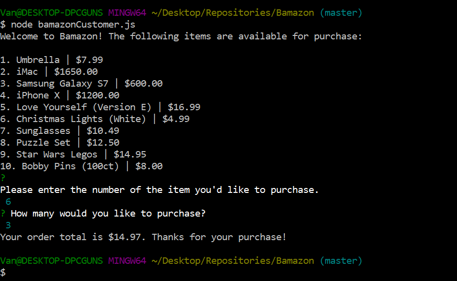
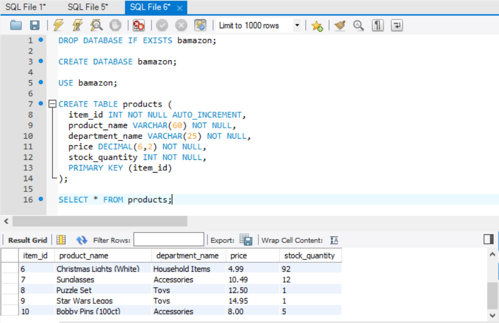
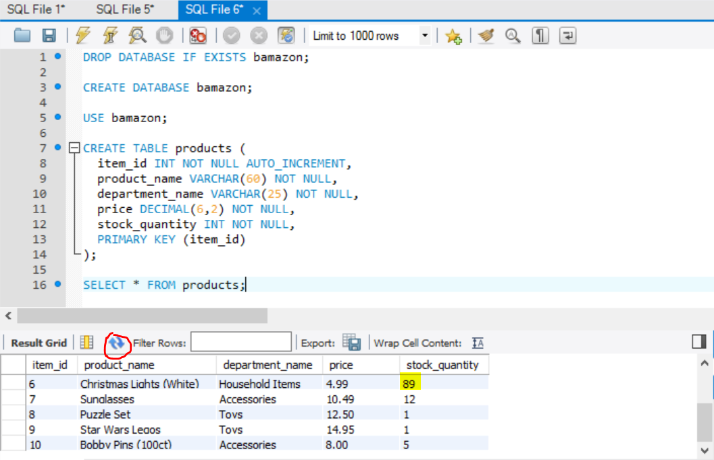

# Bamazon

### Description
Simple Amazon-like storefront app using mySQL and Inquirer via Node.

### Functionality
When the customer accesses the app, Bamazon will list all available items on sale. The user will be prompted to select an item for purchase, followed by the quantity. If the item is in stock, the order will be completed and the customer will see the total receipt for their purchase.

Following a successful purchase, the table will be updated for the remaining quantity - in this case, the stock for Christmas Lights was depleted from 92 to 89:

Bamazon also checks for user input errors. Customers will be booted out if the item id/quantity is not valid or if the item is out of stock:

### Technologies Used
* Javascript
* Node.js
* MySQL
* Inquirer npm package
